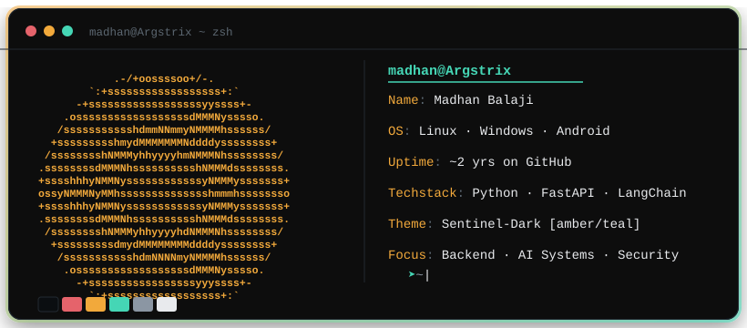

<div align="center">


</div>

<br/>

<div align="center">



</div>

<br/>

### 📖 currently reading `~/about.md`

Engineer who ended up loving the unglamorous parts of the craft &mdash;
event-driven backends, replay-safe data models, and systems that fail predictably instead of
catastrophically. Past internships took me through RAG pipelines and SNMP test automation;
right now I'm two weeks deep into **Sentinel**, a solo project that watches for security
incidents and remediates them autonomously, gated behind a policy engine with a full audit trail.

> 🧾 Co-author, *Adversarial Robust EEG-Based Brain&ndash;Computer Interfaces using a Hierarchical
> Convolutional Neural Network* &mdash; published in **Scientific Reports** (Nature Portfolio).

<br/>

### 🔧 `~/currently-building`

```diff
+ Sentinel — risk-aware autonomous cyber resilience platform
+ policy-gated remediation: restart · quarantine · block IP · disable account · rotate key
+ immutable audit log for every automated action
```

<br/>

### 📦 `~/projects --featured`

| project | what it does | stack |
|---|---|---|
| **Sentinel** | Autonomous cyber resilience platform with policy-gated remediation & audit logging | Python |
| **VCode** | Distributed online coding platform &mdash; microservices, event-driven, replay-safe versioning | Fastify, Kafka, Redis, PostgreSQL, TS |
| **Blockchain Land Registry** | Decentralized land registry with ERC-721 ownership & IPFS document storage | Solidity, React, IPFS, MetaMask |
| **Customer Support Agent** | Stateful support agent with tool-calling & human-in-the-loop approval for high-risk ops | LangGraph, LangChain, ChromaDB |
| **ParallelFFMPEG** | Parallel-processing FFMPEG utility library | Python |
| **EEG-Based CNN** | Hierarchical CNN for adversarial-robust EEG classification (published) | Python, PyTorch |

<br/>

### 📊 `~/stats --github`

<div align="center">


</div>

<br/>

### 🏆 `~/trophies`

<div align="center">


</div>

<br/>

### 🐍 `~/contribution-graph`

<div align="center">


</div>

<br/>

### 🧰 `~/tech-stack`


&nbsp;


&nbsp;


<br/>

### 📫 `~/contact`

[](https://www.linkedin.com/in/madhantb/)
[](mailto:tbmadhan2005@gmail.com)

<div align="center">

</div>
